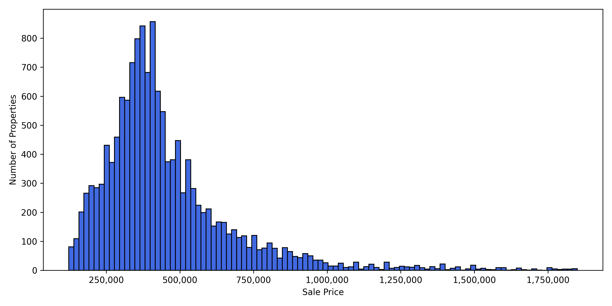
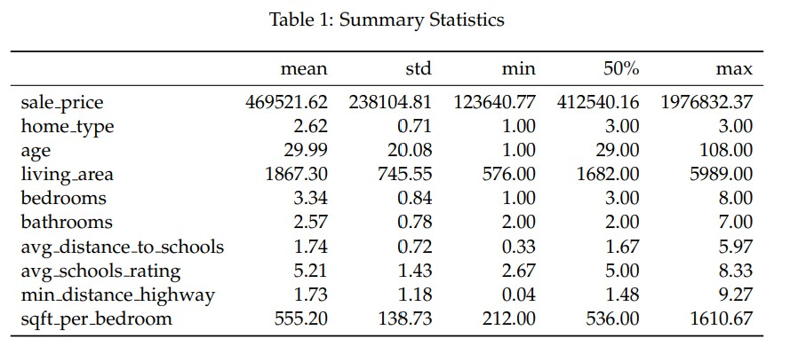
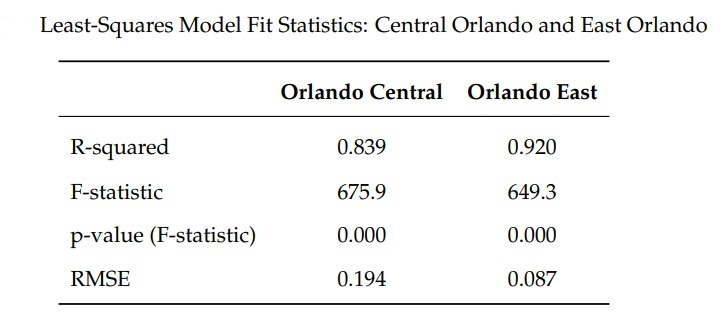
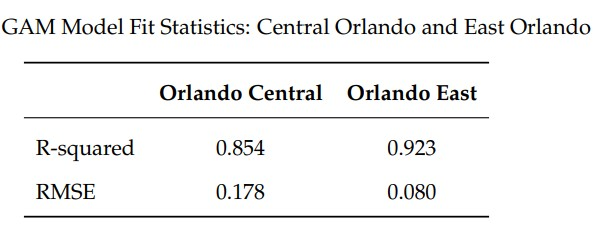
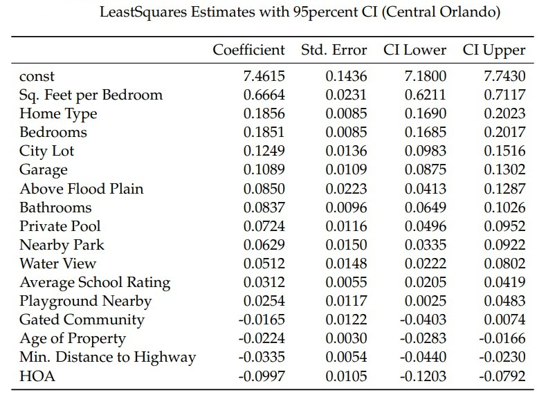
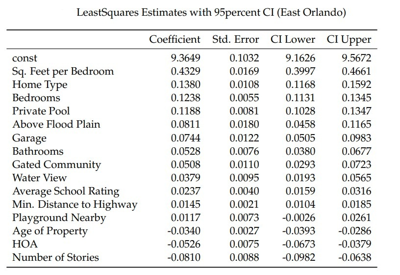
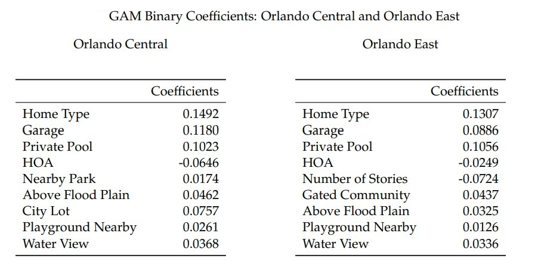

# Housing_Market_Dynamics_Using_Hedonic_Price_Modeling

# Introduction
This project explores housing market dynamics and residential property valuation in Orlando, Florida using hedonic price modeling. With Orlando among the fastest-growing metropolitan areas in the U.S., understanding how home prices are shaped by structural, neighborhood, and locational features is essential for buyers, sellers, developers, and policymakers. The goal of this project was to build an empirical, data-driven framework that estimates the implicit value of housing attributes and uncovers regional differences in how they are priced. This README provides a high-level summary of the project, methods, and findings.  For full details, including data preparation, model specifications, statistical results, and extended discussion, please see the complete paper: [PBaikova-Paper.pdf](PBaikova-Paper.pdf).

# Dataset Overview & Database Setup
The empirical analysis is based on a dataset of publicly available records from the Zillow website, focusing on residential properties marked as sold between January 2023 and May 2025. The geographic scope of the study is limited to ZIP codes within the Orlando postal region, defined specifically as areas where the city name is listed as Orlando, FL.

The SQLite database is organized by ZIP code, with each table storing property transaction records for that area. This design makes it easy to run queries on specific submarkets while maintaining a consistent schema for cross-region analysis.

## Data Engineering
I built a custom Python ETL pipeline to clean and transform the dataset before modeling. Key tasks included:
- Removing outliers using quantile trimming to eliminate extreme values that could bias estimates.
- Standardizing formats and adjusting all prices to real 2025 dollars using CPI to ensure comparability over time.
- Engineering features such as property age, living area per bedroom, HOA presence, and school accessibility.
- Parsing deeply nested JSON-like fields into structured variables suitable for analysis.
- Integrating geospatial analysis with **OSMnx** and **Shapely** to calculate Manhattan distances from each property to major highway exits.

# Modeling Approach
To analyze how housing attributes affect prices, I implemented multiple econometric and machine learning methods. The core model is a log-linear hedonic regression, which decomposes housing prices into the implicit value of individual features. To improve robustness and avoid overfitting, I incorporated LASSO regularization for variable selection, ensuring that only the most influential predictors were retained. In addition, I used Generalized Additive Models (GAMs) to capture nonlinear effects and diminishing returns, allowing the analysis to reveal more complex relationships between features and price. All models were built using Python with libraries such as `pandas`, `statsmodels`, `scikit-learn`, and `pyGAM`.

# Results & Insights

## Key findings:
- Core structural features such as square footage per bedroom, number of bedrooms/bathrooms, pools, and garages consistently added value.  
- Neighborhood effects were also significant: school quality, proximity to highways, and flood risk status shaped prices, though their influence varied by region.  
- GAM analysis highlighted nonlinear dynamics, such as diminishing returns to home size and nonlinear effects of school quality.

## Practical Recommendations:
- Buyers & Sellers: Identified which features add premiums and which reduce value, guiding purchase and marketing decisions.
- Developers & Investors: Showed how to align projects with local preferences (e.g., gated subdivisions in suburbs vs. maximizing lot space in urban cores).
- Policy Makers: Demonstrated how parks, schools, and flood resilience directly translate into property value and tax revenue.

# Conclusion
Overall, the hedonic price modeling can effectively capture how housing features, amenities, and location drive property values across Orlando. By integrating data engineering, geospatial analysis, and advanced statistical methods, the study highlights both universal drivers of value and regional differences in buyer preferences. The results underscore the practical importance of feature-specific insights for real estate stakeholders while laying the groundwork for future research with broader datasets and more granular variables.
